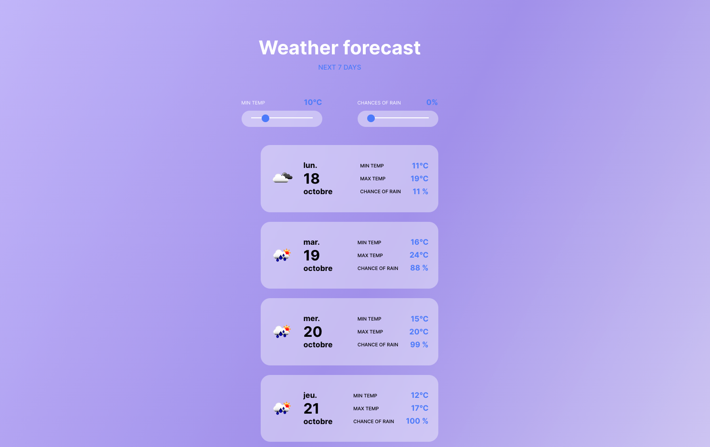

# Weather Forecast App for Paris

This REACT application forcast the Parisian weather for the next seven days. The forecast can be filteres by min temperature as well as chances of rain.

## API

The weather app is retrieving data from the API Daily Forecast 16 days provided by OpenWeather.

## Launch the app

To open the application in the devleopment mode, please type the following code in the console:
`npm test`

